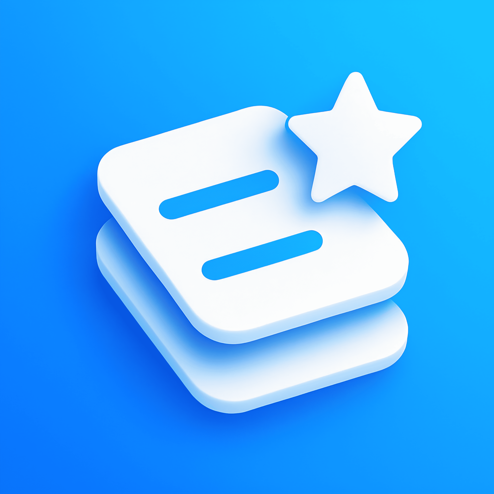

  

## Taskpy 📝

**Taskpy** es una aplicación de gestión de tareas simple, potente y 100% privada, diseñada para ayudarte a organizar tu día a día sin comprometer tus datos. Funciona de manera completamente offline, asegurando que tu información personal y tus tareas nunca abandonen tu dispositivo.

## ✨ Características Principales

Taskpy está lleno de funciones pensadas para mejorar tu productividad y darte control total sobre tu experiencia.

#### **Gestión de Tareas Inteligente**
* **Crea y gestiona tareas** con títulos, descripciones, y fechas y horas de vencimiento.
* **Prioridades con código de color** (Alta, Media, Baja) para identificar visualmente lo más importante.
* **Tareas repetitivas** (diarias, semanales o mensuales) que se generan automáticamente al completarlas.
* **Marca tareas como "Destacadas"** con una estrella para darles un seguimiento especial.

#### **Organización Visual e Intuitiva**
* **Interfaz limpia con pestañas** para separar tus tareas Pendientes, Completadas y Vencidas.
* **Agrupación automática** por "Hoy", "Mañana", "Próximamente" y "Vencidas".
* **Historial de tareas completadas** agrupado por fecha en tarjetas desplegables para una revisión limpia de tus logros.
* **Múltiples opciones para ordenar** tus listas: por fecha, por prioridad o con las destacadas primero.

#### **Notificaciones y Recordatorios**
* **Recordatorios personalizables** para recibir notificaciones antes de la fecha de vencimiento (5 min, 15 min, 1 hora, 1 día antes).
* **Acciones directas en las notificaciones** para "Marcar como completado" o "Posponer" sin abrir la aplicación.

#### **Personalización**
* **Modo Oscuro** y un **Modo Negro Puro (AMOLED)** para cuidar tu vista y la batería de tu dispositivo.
* **Selector de Color de Acento** con una amplia paleta para que la app se sienta tuya.
* **Soporte multi-idioma** con detección automática del idioma del dispositivo (Español e Inglés).

#### **Privacidad y Seguridad (Premium)**
* **100% Offline**: Tus datos se guardan de forma segura en la base de datos local de tu dispositivo. Nunca se envían a ningún servidor.
* **Bloqueo Biométrico**: Protege tu lista de tareas con tu huella dactilar o Face ID.
* **Copia de Seguridad y Restauración**: Exporta e importa todas tus tareas en un archivo `.json` para tener control total sobre tus datos.

#### **Estadísticas de Productividad**
* Una pantalla dedicada a **estadísticas** para visualizar tu progreso, incluyendo:
    * Tasa de finalización.
    * Gráfico de tareas completadas en la última semana.
    * Gráfico circular con el desglose por prioridad.
    * Identificación de tu "día más productivo" de la semana.

## 🛠️ Creado con
* **Flutter & Dart**: Para una experiencia de usuario fluida y nativa.
* **Provider**: Para la gestión de estado.
* **sqflite**: Para la base de datos local 100% offline.
* **shared\_preferences**: Para guardar las preferencias del usuario.
* **flutter\_local\_notifications**: Para la gestión de notificaciones y recordatorios.
* **in\_app\_purchase**: Para gestionar las funciones Premium.
* **fl\_chart**: Para los gráficos de la pantalla de estadísticas.
* **Internacionalización (i18n)**: Soporte nativo de Flutter para múltiples idiomas.

## 🚀 Próximas Funciones
Taskpy está en constante desarrollo. Algunas de las funciones que estamos explorando para el futuro son:
* Proyectos y Listas Múltiples.
* Sub-tareas para dividir trabajos complejos.
* Widgets para la pantalla de inicio.
* Soporte para más idiomas.

## 💬 Contacto y Feedback
¿Tienes alguna sugerencia o encontraste un error? ¡Me encantaría saberlo!
* **HugoA-dev** - dev.hugoa@gmail.com

## 📄 Licencia
Distribuido bajo la Licencia MIT. Ver el archivo [LICENSE](LICENSE) para más información.
